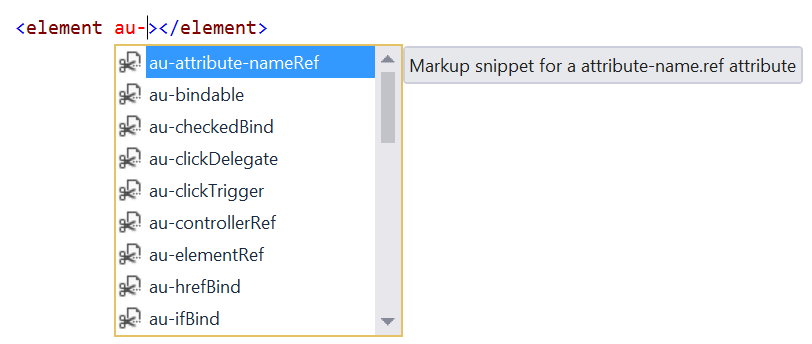
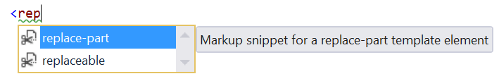

## Aurelia Pack for Visual Studio

Download this extension from the
[VS Gallery](https://visualstudiogallery.msdn.microsoft.com/57a8ac31-775a-428c-ade9-6837d183a4dc)
or get the
[nightly build](http://vsixgallery.com/extension/17d3b53c-0064-4dab-b9ab-c009476911aa/).

-----------------------------------------

A snippet pack to make you more productive working with HTML.

Based on the excellent [Aurelia Snippets for VS Code](https://github.com/behzad888/vscode-aurelia-snippets) extension.

## HTML Snippets
There is a bunch of snippets for various Aurelia HTML attributes:

And for HTML elements as well:

## JavaScript snippets
coming soon...

## TypeScript snippets
Not supported by the TypeScript editor in Visual Studio 2015 and earlier

## Contribute
Check out the [contribution guidelines](.github/CONTRIBUTING.md)
if you want to contribute to this project.

For cloning and building this project yourself, make sure
to install the
[Extensibility Tools 2015](https://visualstudiogallery.msdn.microsoft.com/ab39a092-1343-46e2-b0f1-6a3f91155aa6)
extension for Visual Studio which enables some features
used by this project.

## License
[Apache 2.0](LICENSE)